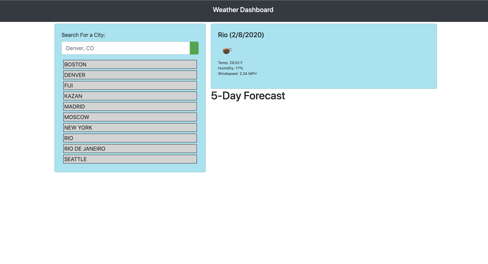

# weather-predictions-app-

A weather dashboard is application with search functionality to find current weather conditions and the future weather outlook for multiple cities.

In this application user can search for weather reports by city using the openweathermap API. After searching for a city, the following information is displayed: 

Current temperature
Current humidity
Windspeed
5 day forecast

Application uses icons to represent weather conditions. Application stores previously searched for cities in localstorage and displays them to the user. Application loads last searched city forecast on page load.
